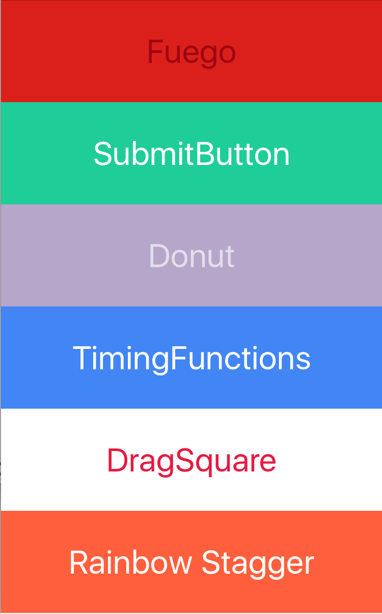

# react-native-animation-showcase
Show case of a couple of wip animation examples.

[Here is a link to a google sheets presentation of what is going on in these animations](https://docs.google.com/presentation/d/1vfLPrTdiWnugZoynTpphvEALJlxp6nbKwQvLkuXLC6E/edit?usp=sharing)

## Installing && Running

```
git clone https://github.com/CapitanRedBeard/react-native-animation-showcase
cd react-native-animation-showcase
react-native run-ios
```

## Animations
Just select one of the present animations to check it out. Feel free to fork or modify any existing assets. A lot of these animations were built with prototyping in mind, so there is a lot of work to be added around correctly composing these components.

If you've come looking for the submit button, it is going to be pulled out and polished as it's own 3rd party plugin with some semantic parameters. 




